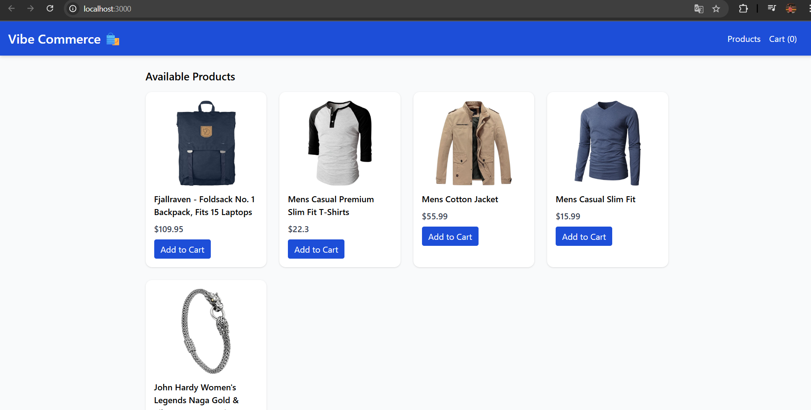
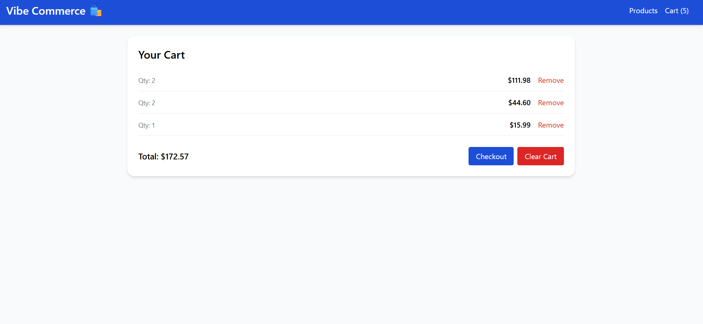
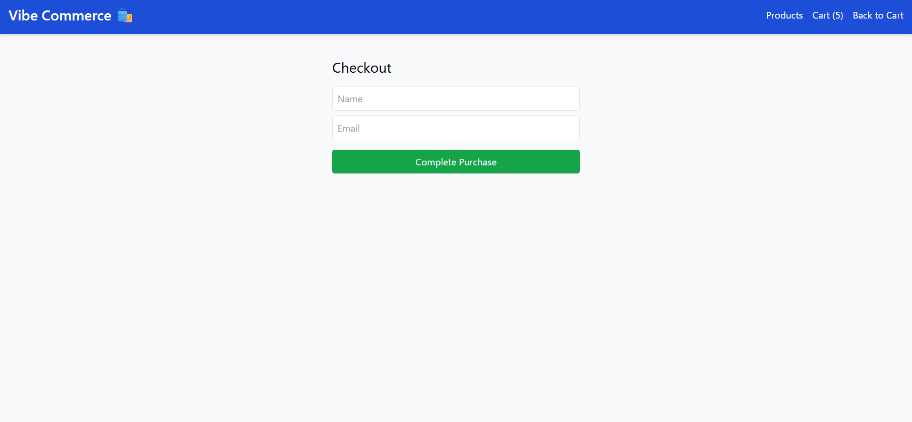
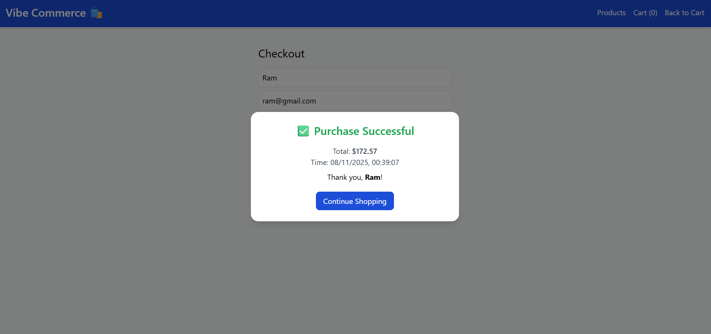

# 🛒 Mock E-Commerce Cart (Vibe Commerce Assignment)

A **full-stack shopping cart application** built for the **Vibe Commerce App**, demonstrating core e-commerce flows — including product listing, cart management, checkout, and receipt generation — with complete frontend-backend integration.

---

## 🚀 Features

### 🧩 Frontend (React)
- Displays products in a responsive grid layout.
- Add products to cart with quantity updates.
- Automatically increments quantity when the same item is added again.
- Remove items individually from the cart.
- Displays total price dynamically.
- Checkout form with name and email validation.
- Receipt displayed after successful checkout.
- “Clear Cart” button to remove all items at once.
- Responsive and user-friendly UI.

### ⚙️ Backend (Node.js + Express + SQLite)
- **GET /api/products** → Fetches mock products (from FakeStoreAPI).
- **POST /api/cart** → Adds an item or updates quantity if it already exists.
- **GET /api/cart** → Retrieves cart items with total cost.
- **DELETE /api/cart/:id** → Removes a single item from the cart.
- **DELETE /api/cart** → Clears the entire cart.
- **POST /api/checkout** → Returns a mock receipt with customer details, total, and timestamp.
- Database persistence using **SQLite**.
- Error handling for invalid requests.

---

## 🧠 Tech Stack

| Layer | Technology |
|-------|-------------|
| **Frontend** | React.js, Fetch API, CSS |
| **Backend** | Node.js, Express.js |
| **Database** | SQLite3 |
| **External API** | Fake Store API |
| **Language** | JavaScript (ES6+) |

---

## 📸Screenshots

**Products**  

**Cart + Clear Button**  

**Receipt Modal**  

**Receipt Modal**  

---

